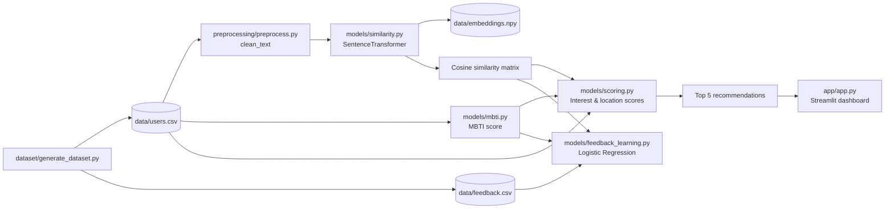
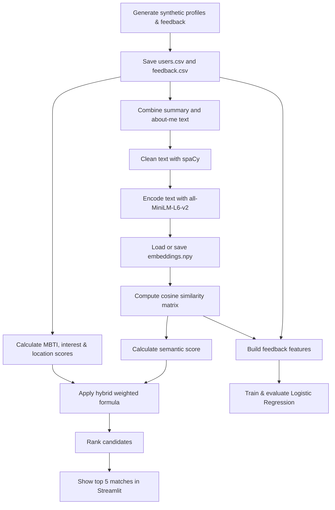
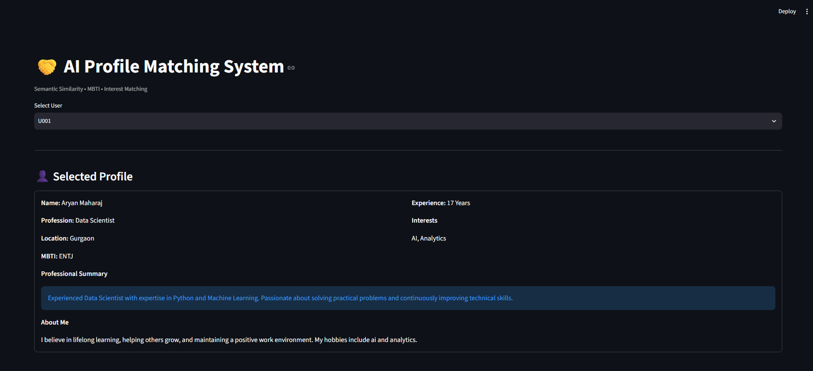
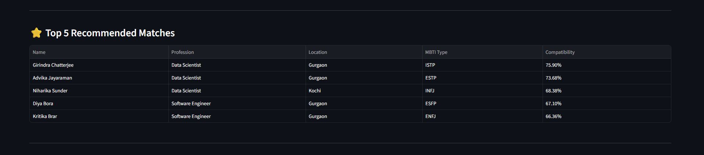
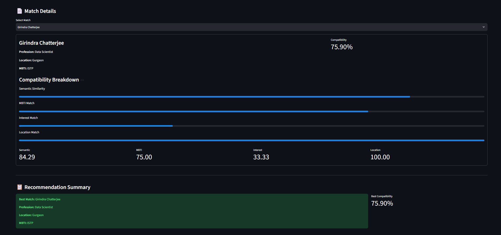

<div align="center">

# 🤝 AI Profile-Based Matching System

### A hybrid recommendation system for discovering compatible user profiles


</div>

## 🌟 Project Overview

**AI Profile-Based Matching System** is a Python major project that recommends compatible profiles from a synthetic user dataset. It combines semantic understanding of profile text with MBTI personality similarity, shared interests, and location to produce a ranked **compatibility score out of 100**.

Profile text is cleaned with spaCy, encoded by the `all-MiniLM-L6-v2` Sentence Transformer, and compared with cosine similarity. The Streamlit interface lets a user select a profile, review the top five matches, and inspect each score component.

> ℹ️ The repository includes synthetic profiles and synthetic interaction feedback generated with Faker; it does not use real user data.

## ✨ Features

- 👥 Generates 100 synthetic profiles with professional, personal, MBTI, interest, and location data.
- 🧹 Cleans profile text through lowercasing, URL/non-letter removal, whitespace normalization, lemmatization, and stop-word removal.
- 🧠 Creates Sentence Transformer embeddings using `all-MiniLM-L6-v2`.
- 📐 Computes pairwise cosine similarity between all processed profiles.
- 🧩 Scores MBTI types character by character.
- 🎯 Calculates Jaccard-style interest overlap and exact location matching.
- ⚖️ Produces a weighted hybrid compatibility score and returns the top five profiles.
- 📊 Trains and evaluates a Logistic Regression model on the synthetic feedback data.
- 🖥️ Provides a Streamlit view for profile selection, recommendations, detailed score breakdowns, and the best-match summary.

<details>
<summary><strong>What the app currently does not do</strong></summary>

The feedback model is trained and evaluated by `models/feedback_learning.py`, but its predictions or learned coefficients are not used to alter the scoring weights or the Streamlit recommendations. The current UI is read-only and does not collect new feedback.

</details>

## 🧰 Technologies Used

| Technology | Purpose in this project |
| --- | --- |
| Python | Core language |
| Pandas & NumPy | Tabular data handling and embedding storage |
| spaCy | Text tokenization, lemmatization, and stop-word filtering |
| Sentence Transformers | `all-MiniLM-L6-v2` embedding model |
| PyTorch | Runtime device selection for the embedding model (CUDA when available) |
| scikit-learn | Cosine similarity, Logistic Regression, train/test split, and evaluation metrics |
| Streamlit | Interactive matching dashboard |
| Faker | Synthetic profile generation |

## 🏗️ Project Architecture



## 📁 Folder Structure

```text
Profile-Based-Matching/
├── app/
│   └── app.py                  # Streamlit interface and recommendation display
├── data/
│   ├── embeddings.npy          # Cached Sentence Transformer embeddings
│   ├── feedback.csv            # Synthetic binary interaction feedback
│   └── users.csv               # Synthetic user-profile dataset
├── dataset/
│   └── generate_dataset.py     # Generates users.csv and feedback.csv
├── models/
│   ├── __init__.py
│   ├── feedback_learning.py    # Logistic Regression training and evaluation script
│   ├── mbti.py                 # MBTI similarity scoring
│   ├── scoring.py              # Hybrid scoring and top-match ranking
│   └── similarity.py           # Text loading, embeddings, and cosine similarities
├── preprocessing/
│   ├── __init__.py
│   └── preprocess.py           # spaCy-based text cleaning
└── requirements.txt            # Pinned Python dependencies
```

## 🔍 How the Matching Algorithm Works

For a selected user, the application compares that profile with every other user in `data/users.csv`. It excludes the selected profile, calculates four component scores, sorts candidates by the combined score, and returns the top `n` results (five in the Streamlit app).

### 🧠 NLP and semantic-similarity pipeline

1. `similarity.py` joins `professional_summary` and `about_me` into `combined_text`.
2. `clean_text()` lowercases text, removes URLs and non-alphabetic characters, normalizes whitespace, then uses spaCy to lemmatize tokens and remove stop words, punctuation, and spaces.
3. The cleaned text is encoded in batches of 32 by `SentenceTransformer("all-MiniLM-L6-v2")`.
4. Embeddings are cached at `data/embeddings.npy`; a subsequent run loads this file when it exists.
5. scikit-learn computes a cosine-similarity matrix. Semantic similarity is converted to a percentage by multiplying by 100.

### 🧩 MBTI compatibility logic

`mbti_score(type1, type2)` works as follows:

- Identical types receive **90**.
- Otherwise, the score starts at **50**.
- For each of the four aligned MBTI letters, a matching letter adds **10** and a differing letter adds **5**.
- The result is capped at **100**.

This is a deterministic similarity heuristic implemented in the project; it is not a clinical or psychological compatibility assessment.

### 🎯 Interest and location scores

- **Interest score:** `|intersection| / |union| × 100` over the comma-separated interest sets.
- **Location score:** `100` if both users have exactly the same location; otherwise `0`.

### ⚖️ Hybrid compatibility formula

The score from `models/scoring.py` is:

```text
Compatibility = (0.50 × Semantic)
              + (0.25 × MBTI)
              + (0.15 × Interest)
              + (0.10 × Location)
```

Each component is expressed on a 0–100 scale in the recommendation output.

## 🤖 Feedback Learning Model

`models/feedback_learning.py` reads `data/feedback.csv` and builds four features for every recorded user pair:

| Feature | Source |
| --- | --- |
| Semantic | Cosine similarity from the embedding similarity matrix (0–1 in this script) |
| MBTI | The project’s MBTI score |
| Interest | Jaccard-style interest-overlap percentage |
| Location | Exact-match score: 100 or 0 |

It uses the feedback column `action` as the binary target, performs a stratified 80/20 train/test split with `random_state=42`, and trains `LogisticRegression(max_iter=1000, random_state=42)`. The script prints accuracy, precision, recall, F1 score, confusion matrix, classification report, and learned feature coefficients.

## 🖥️ Streamlit Application

The dashboard in `app/app.py`:

1. Presents a dropdown of available `user_id` values.
2. Shows the selected user’s name, profession, location, MBTI type, experience, interests, professional summary, and about-me text.
3. Displays the five highest-ranked recommendations in a table.
4. Lets the user select a recommended match to view progress bars and metrics for semantic, MBTI, interest, and location components.
5. Highlights the highest-ranked profile as the best match.

## 🚀 Installation

### 1. Clone the repository

```bash
git clone <repository-url>
cd Profile-Based-Matching
```

### 2. Create and activate a virtual environment (recommended)

```bash
python -m venv .venv
```

**Windows PowerShell**

```powershell
.\.venv\Scripts\Activate.ps1
```

**macOS/Linux**

```bash
source .venv/bin/activate
```

### 3. Install dependencies

```bash
pip install -r requirements.txt
```

### 4. Install the spaCy English model

The preprocessing code loads `en_core_web_sm`. Install spaCy and its model if they are not already available in your environment:

```bash
pip install spacy
python -m spacy download en_core_web_sm
```

> ⚠️ `spacy` and `en_core_web_sm` are required by the current preprocessing code but are not listed in `requirements.txt`.

## ▶️ Usage

Run the Streamlit application from the project root:

```bash
streamlit run app/app.py
```

Then open the local URL shown by Streamlit, select a user ID, and explore the ranked matches and compatibility breakdown.

### Optional: regenerate the synthetic data

```bash
python dataset/generate_dataset.py
```

This overwrites `data/users.csv` and `data/feedback.csv`. If the user dataset changes, delete `data/embeddings.npy` before the next run so `similarity.py` creates embeddings for the updated profiles.

### Optional: run feedback-model evaluation

```bash
python models/feedback_learning.py
```

## 🔄 Project Workflow



## 📸 Screenshots

### Home / Selected Profile



### Top Recommendations



### Match Details



## 🔮 Future Improvements

- Integrate feedback-model predictions into live recommendation ranking.
- Support real-time data storage and profile updates.
- Add user authentication and profile management.
- Deploy the Streamlit application online.
- Learn personalized component weights from user feedback.
- Extend the feedback pipeline with richer interaction signals and model evaluation tracking.

## 🎓 Learning Outcomes

- Building a complete ML-oriented application from synthetic-data generation to a user interface.
- Applying NLP preprocessing and transformer embeddings to profile text.
- Combining multiple signals into an interpretable hybrid recommendation score.
- Using cosine similarity for semantic retrieval.
- Training and evaluating a binary Logistic Regression classifier.
- Presenting model-derived recommendations clearly with Streamlit.

## 📄 License

No license file is currently included in this repository. Add a `LICENSE` file to specify how the project may be used, modified, and distributed.

## 👤 Author

Developed as a Machine Learning major project.
